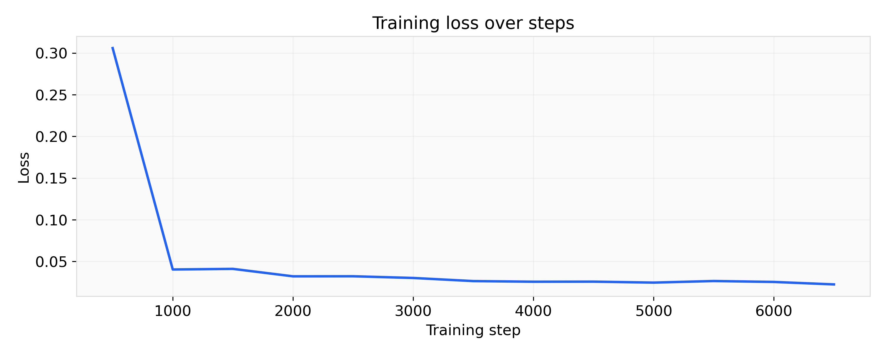
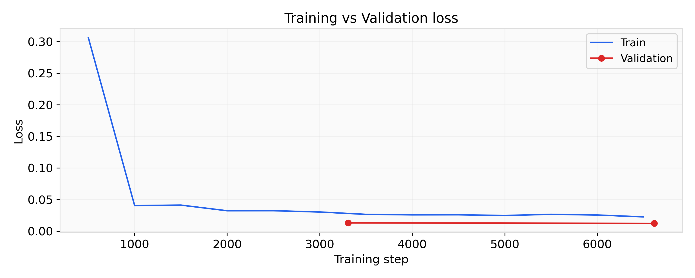
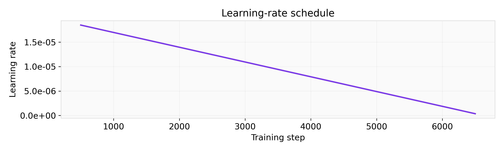
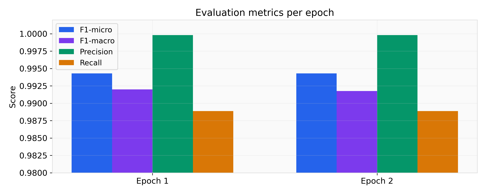
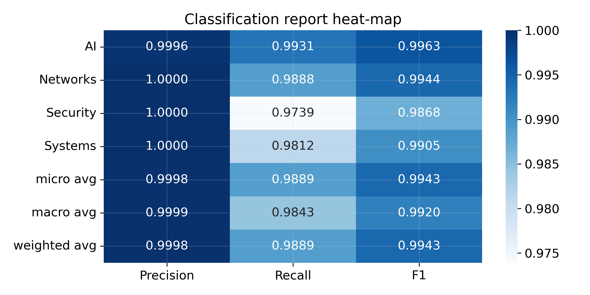
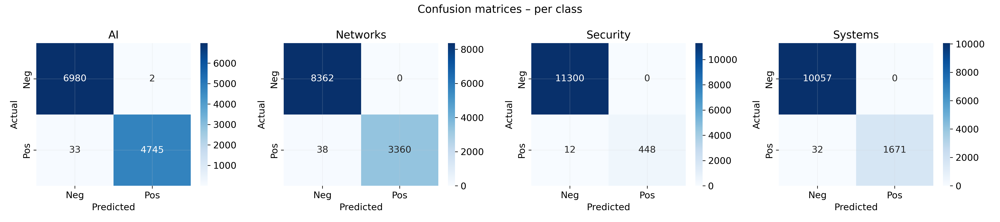
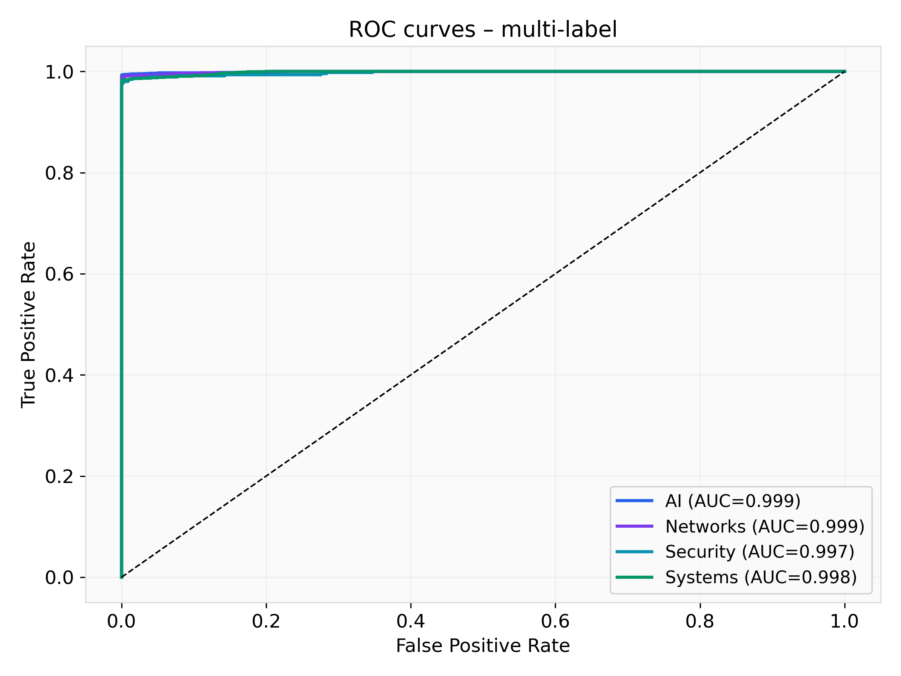
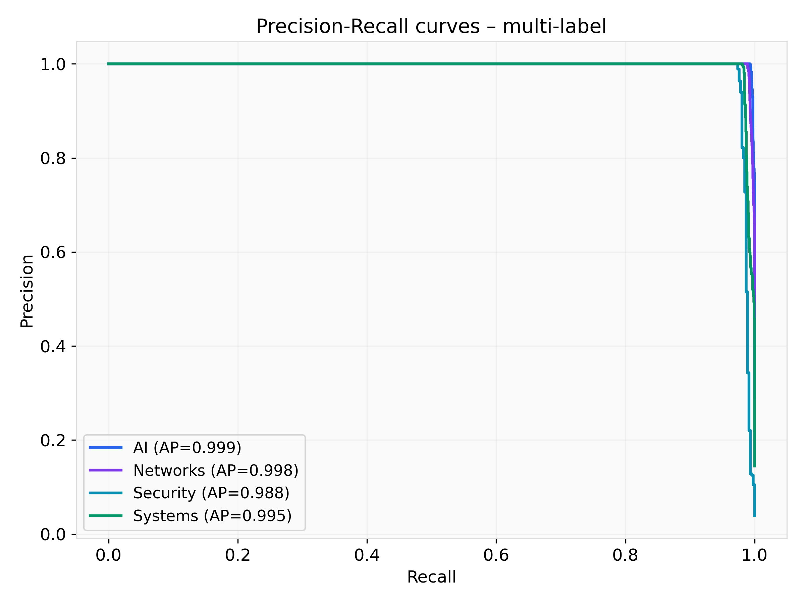

# Explainable ArXiv Paper Classifier

**Multi‑Label Research Paper Classification with Interpretable AI**

[](https://python.org)
[](https://fastapi.tiangolo.com)
[](https://react.dev)
[](https://huggingface.co)

---

Application that classifies research paper abstracts into ArXiv categories and visually explains *why* the model made its predictions — using LIME, SHAP, and native BERT attention mapping.

---

## Model Training & Evaluation Report

All figures are generated by `model_training/generate_report_full.py` and saved in the `screenshots/` directory.

---

<table>
<tr>
<td align="center">
<b>Training Loss</b><br>

</td>
<td align="center">
<b>Train vs Validation Loss</b><br>

</td>
</tr>

<tr>
<td align="center">
<b>Learning Rate</b><br>

</td>
<td align="center">
<b>Evaluation Metrics</b><br>

</td>
</tr>

<tr>
<td align="center">
<b>Classification Report</b><br>

</td>
<td align="center">
<b>Confusion Matrices</b><br>

</td>
</tr>

<tr>
<td align="center">
<b>ROC Curves</b><br>

</td>
<td align="center">
<b>Precision-Recall Curves</b><br>

</td>
</tr>
</table>

<br>

📄 Full text report: `screenshots/classification_report.txt`

---

## Features

- Multi‑label classification with DistilBERT
- LIME explanations
- SHAP analysis
- Attention mapping
- Real‑time inference via FastAPI
- Clean white‑themed UI

---

## Architecture

```
Arxiv-reseach-100k/
│
├── frontend/                          # React + Vite
│   ├── src/
│   │   ├── App.jsx
│   │   ├── components/
│   │   │   └── ExplainabilityViewer.jsx
│   │   ├── index.css
│   │   └── main.jsx
│   └── index.html
│
├── backend/                           # FastAPI server
│   ├── main.py
│   └── explainability.py
│
├── model_training/                    # Training & reporting scripts
│   ├── process_data.py
│   ├── text_classifier.py
│   ├── generate_report_full.py
│   └── generate_report_small.py
│
├── data/                              # Raw / processed data
├── bert-multi-label-model/            # Model checkpoints
└── screenshots/                       # Generated figures and reports
```

---

## Tech Stack

| Layer | Technology |
|-------|------------|
| Frontend | React 18, Vite, Vanilla CSS |
| Backend | FastAPI, Uvicorn, Pydantic |
| Model | DistilBERT (HuggingFace Transformers) |
| Explainability | LIME, SHAP, native attention |
| Data processing | Scikit‑learn, NumPy, Datasets |

---

## Quick Start

### Prerequisites

- Node.js ≥ 18 & npm
- Python ≥ 3.8

### Backend

```bash
python -m venv venv
# Windows
.\venv\Scripts\activate
# macOS / Linux
source venv/bin/activate
pip install -r backend/requirements.txt
uvicorn backend/main:app --reload --port 8000
```

### Frontend

```bash
cd frontend
npm install
npm run dev
```

The app will be available at `http://localhost:5173`.

---

## Model Training

1. Download the dataset from the HuggingFace link and place `ML-Arxiv-Papers.csv` in `data/`.
2. Process the data:
   ```bash
   cd model_training
   python process_data.py
   ```
3. Fine‑tune DistilBERT:
   ```bash
   python text_classifier.py --train
   ```
   Checkpoints are saved after each epoch.
4. Update `backend/explainability.py` to point to the `final/` model folder if you trained a new model.

---

## Explainability Methods

| Method    | What it Shows                           | Color Coding |
|-----------|-----------------------------------------|--------------|
| LIME      | Per‑word contribution to prediction     | Green = supports, Red = opposes |
| SHAP      | Shapley‑value feature importance        | Blue = high impact, Gray = low impact |
| Attention | Transformer self‑attention weights       | Purple intensity = attention strength |

---

## API Reference

### `POST /predict`

Classify an abstract into ArXiv categories.

```json
{ "abstract": "We propose a novel transformer architecture for..." }
```

Response:

```json
{ "predictions": [{ "label": "cs.LG", "confidence": 0.92 }, ...] }
```

### `POST /explain`

Get interpretability results for a given abstract.

```json
{ "abstract": "...", "method": "lime" }
```

Response:

```json
{ "explanation": { "tokens": [...], "scores": [...] } }
```
Supported methods: `lime`, `shap`, `attention`.

---

## Contributing

1. Fork the repository
2. Create a feature branch (`git checkout -b feature/your-feature`)
3. Commit your changes (`git commit -m 'Add your feature'`)
4. Push to the branch (`git push origin feature/your-feature`)
5. Open a Pull Request

---

## License

MIT License

---

*Built with care for explainable AI*
